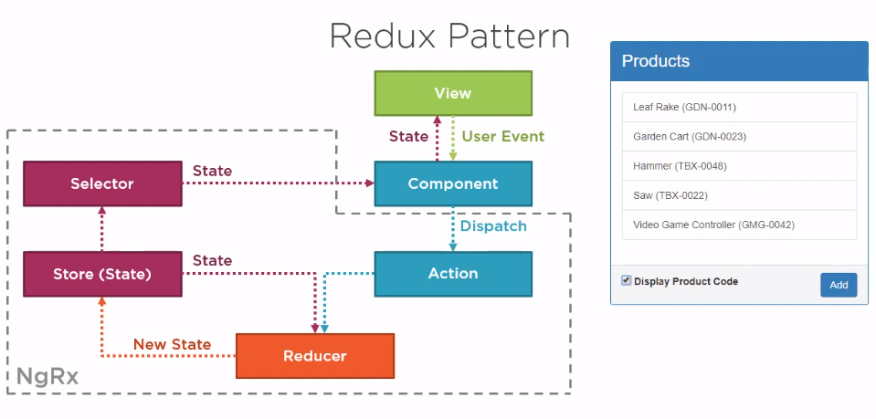
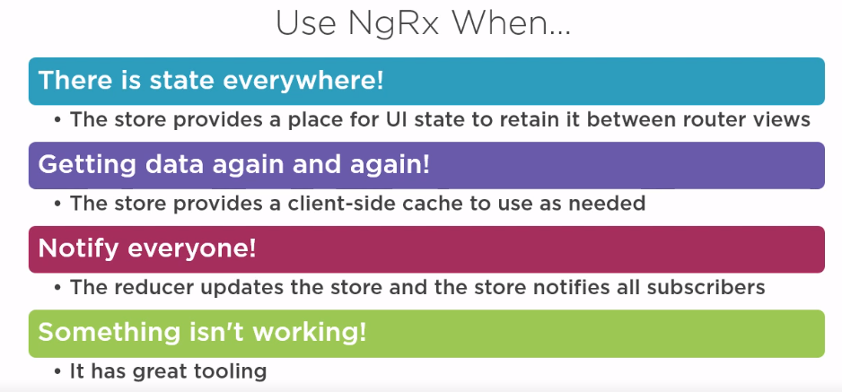

## NgRx

The ngrx library brings Redux patterns to Angular using RxJS.

#### Redux

Redux is a way to implement a predictable state container for JavaScript apps.
The Redux pattern, which NgRx is based on, has three main principles.
**First,** there is only one single source of truth for application state called the store.
**Second** is that state is ready-only and the only way to change state is to dispatch an action.
**third**, is changes to the store are made using pure functions called reducers.

###### when use redux-pattern:

##### Benefits of Redux

**Global Data:** The Redux pattern allows you to observe the current data state from anywhere in the app.
**Debugging:** Because you have a sequence of state changes, you debug redux apps by comparing one state to another. This gives you a time lapse breakdown of your data.

**Isolation of Data:** Data flows one-way and is completely isolated from presentation.

**Type Safety:** TypeScript and Redux go together like rainbows and unicorns. Redux gives you good incentive to take advantage strong typing, which will result in better tooling and maintainability.

##### Drawbacks of Redux

**More Code/Learning Curve:** Maintaining an immutable data store simply results in more code. I would not consider the learning curve very steep, but it is a whole new set of ideas to wrap your head around.
**Decreased Flexibility:** Integrating the Redux pattern with 3rd party packages can be difficult. You need to build your own declarative interface for application data that is altered by external libraries.
**Potential Performance Issues:** There are some cases when it is not performant to mount a single data store on the client. Imagine a large state object that needs to be copied after an event that fires every 5ms - that’s going to weigh you down at some point.

#### Store:

The store is literally a JavaScript object that holds all of your application state. You can think of it as a client-side database. With Angular, you may be building services to hold your application state. Following the Redux pattern, all of this state instead is retained in the store. This becomes very powerful when it comes to reasoning about user interaction, debugging, performances, and avoiding race conditions in general.

###### A state object cannot be changed - it is immutable.

###### When data changes, the existing state is duplicated, then a new object is created with the updates. In Angular this data is treated as an RxJS Observable, allowing us to subscribe to it from anywhere in the app.

**What should not go to store**
**i. Unshared state:** Unshared state that is solely owned by a single component that does not need to be shared or made available across routes.
**ii. Angular Forms:** Angular forms also don't belong in the store as they are usually self contained and do not need to be shared across multiple components. Also, Angular forms are not serializable or immutable and can change themselves, meaning you will not be able to track those changes with actions, which is the second principle of Redux, that to change state you need to dispatch actions.
**iii. Non serilized state:** Finally, state that has cycles in it or has complex data structures that cannot be serialized should not be put into the store. For example, the whole router state should not be put into the store because it is not serializable.

##### Action:

Actions are basically simple JavaScript objects with a type as a string and an optional payload that can be of any type. When we say the store is read-only and that to change state we dispatch actions, we mean you shouldn't mutate the state and you should follow the principle of immutability, meaning that if you need to change the state of the store, then replace the whole state object and not just mutate part of it.

State can only be changed via an action, which is also an object. It includes a type (the action name) and an optional payload (the action data),
for example **{ type: 'DELETE_ITEM', payload: 123 }.**

State can only be changed via an action, which is also an object. It includes a type (the action name) and an optional payload (the action data),
for example **{ type: 'DELETE_ITEM', payload: 123 }.**

##### Reducer:

Reducers are functions that specify how state changes in response to an action.
A reducer is a pure function, accepting two arguments. The previous state and an action dispatched to update state. Reducers use switch statements to listen and act on specific action types, taking the actions payload and state and returning new state.
function reducer(state,action){
switch(action.type){
case 'LOAD_USER':{
return {users:[...state.users,action.payload]};
}
}  
}

###### Pure Function:

A pure function is a function, given the same arguments, will always return the same value with no observable side effects.
function sum(a,b){
const result=a+b;
return result;
}
**So pure functions will always return consistent results, but also pure functions will not mutate or access properties outside of their function scope.**
**unpurefunction**
var c=2;
function sum(a,b){
const result=a+b+c;
return result;
}
**This is an impure function because it depends on outside variables.**
